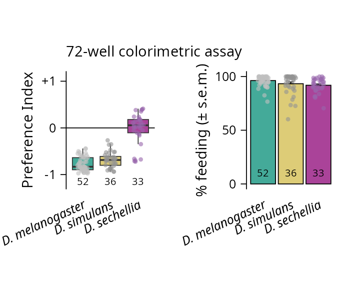
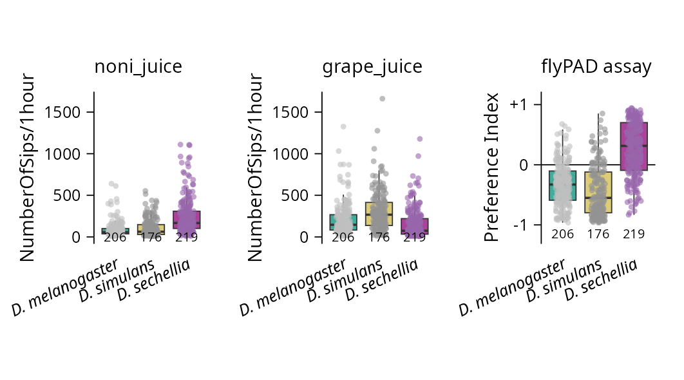
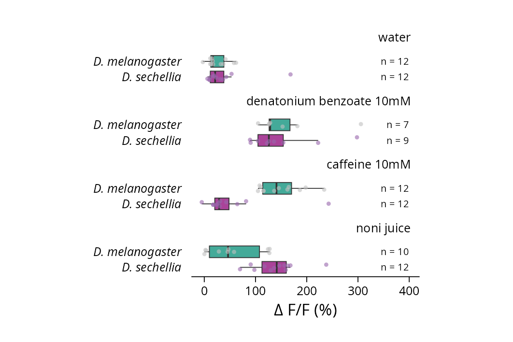
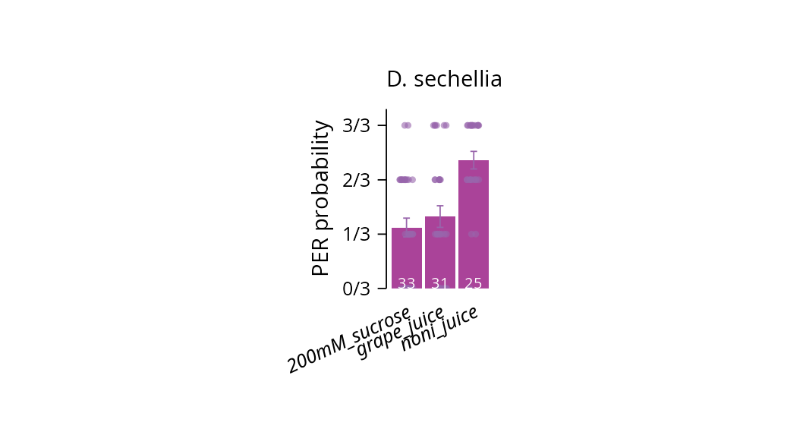
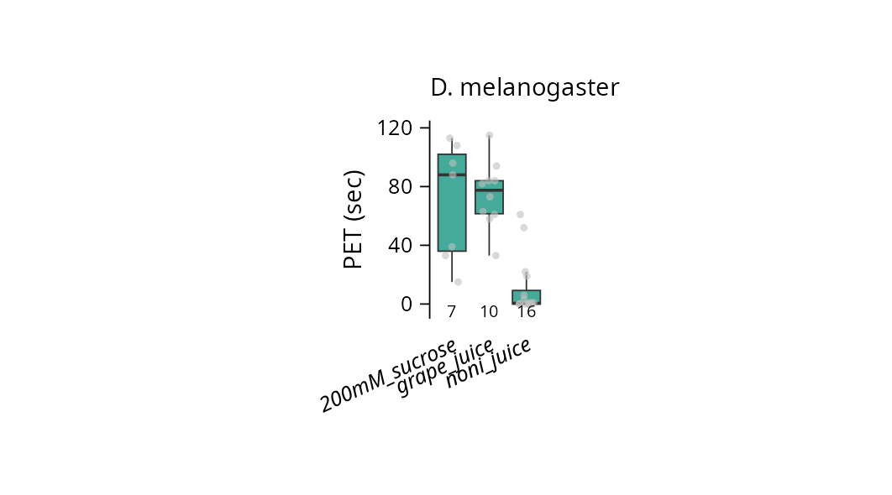

# Evolution of taste processing shifts dietary preference

> Enrico Bertolini, Daniel Münch, Justine Pascual, Noemi Sgammeglia, Matteo Bruzzone, Carlos Ribeiro, and Thomas O. Auer

This repository shares data and scripts behind the analyses presented in the following works:

- [Bertolini et al., 2024 bioRxiv](https://www.biorxiv.org/content/10.1101/2024.10.11.617601v1)

- [Bertolini et al., 2025 Nature](https://www.nature.com/articles/s41586-025-09766-6)

---

## Contents

- `data/` - processed datasets  (.tsv)
- `scripts/` - analysis and visualization code (.Rmd)
- `output/` -  generated figures

---

## Usage example

```r
if(!require("tidyverse")) {
  install.packages("tidyverse")
  library(tidyverse)
}

for (i in list.files("../R/", full.names = TRUE, pattern = '.R')) {
  source(i)
}
```

### 1. Colorimetric assay data

```r
read_tsv(file = "../data/behaviour_colorimetric_assays.tsv", show_col_types = FALSE) %>%
  filter(
    assay_type == "72-well colorimetric",
    two_choice == "noni juice vs grape juice"
  ) %>%
  select(everything()) -> df

df %>%
  plot_PI(
    x_var = species,
    order_x = order_species(),
    title = "72-well colorimetric assay"
  )

df %>%
  plot_perc_feeding(
    x_var = species,
    order_x = order_species()
  )    
```



```r
# STATS

kruskal.test(df$preference_index ~ df$species)

dunn.test::dunn.test(
  x = df$preference_index,
  g = df$species,
  kw = TRUE,
  method = "bonferroni"
)
```

```r
##  Kruskal-Wallis rank sum test
## 
## data:  df$preference_index by df$species
## Kruskal-Wallis chi-squared = 59.16, df = 2, p-value = 1.424e-13
##
##                            Comparison of x by group                            
##                                  (Bonferroni)                                  
## Col Mean-|
## Row Mean |   D. melan   D. seche
## ---------+----------------------
## D. seche |  -7.604109
##          |    0.0000*
##          |
## D. simul |  -1.969630   5.250384
##          |     0.0733    0.0000*
## 
## alpha = 0.05
## Reject Ho if p <= alpha/2
```

### 2. flyPAD assay data

```r
read_tsv(file = "../data/behaviour_flyPAD_assay.tsv", show_col_types = FALSE) %>%
  filter(
    tastant_comparison == "noni juice vs grape juice",
    species %in% c("D. melanogaster", "D. simulans", "D. sechellia"),
    strain %in% c("Canton-S", "Oregon-R", "04", "196", "07", "28")
  ) %>%
  select(everything()) -> df


df %>% 
  plot_flyPAD(
    x_var = species,
    food_A = "noni_juice",
    food_B = "grape_juice",
    order_x = order_species(),
    title = "flyPAD assay"    
    )
```



```r
# STATS

df %>% 
  calculate_PI(
    x_var = species,
    food_A = "noni_juice",
    food_B = "grape_juice"
    ) %>% 
  select(everything()) -> df

kruskal.test(df$preference_index ~ df$species)

dunn.test::dunn.test(
  x = df$preference_index,
  g = df$species,
  kw = TRUE,
  method = "bonferroni"
)
```

```r
##  Kruskal-Wallis rank sum test
## 
## data:  df$preference_index by df$species
## Kruskal-Wallis chi-squared = 205.69, df = 2, p-value < 2.2e-16
##
##                            Comparison of x by group                            
##                                  (Bonferroni)                                  
## Col Mean-|
## Row Mean |   D. melan   D. seche
## ---------+----------------------
## D. seche |  -11.16361
##          |    0.0000*
##          |
## D. simul |   2.423198   13.16046
##          |    0.0231*    0.0000*
## 
## alpha = 0.05
## Reject Ho if p <= alpha/2
```

### 3. Cell counts data

```r
read_tsv(file = "../data/taste_cell_counts.tsv", show_col_types = FALSE) %>%
  filter(driver == "Gr64f-GAL4",
         sex == "female",
         tissue == "labellum") %>%
  select(everything()) -> df

df %>%   
  plot_cell_counts(
    x_var = species,
    ymax = 40,
    order_x = order_species(),
    title = "Gr64f\nlabellum\nfemales"
  )
```


```r
# STATS

kruskal.test(df$number_cells ~ df$species)

dunn.test::dunn.test(
  x = df$number_cells,
  g = df$species,
  kw = TRUE,
  method = "bonferroni"
)
```

```r
##  Kruskal-Wallis rank sum test
## 
## data:  df$number_cells by df$species
## Kruskal-Wallis chi-squared = 14.05, df = 2, p-value = 0.0008894
##
##                            Comparison of x by group                            
##                                  (Bonferroni)                                  
## Col Mean-|
## Row Mean |   D. melan   D. seche
## ---------+----------------------
## D. seche |   2.752731
##          |    0.0089*
##          |
## D. simul |  -0.711254  -3.612888
##          |     0.7154    0.0005*
## 
## alpha = 0.05
## Reject Ho if p <= alpha/2
```

### 4. Calcium imaging

#### 4.1 Widefield imaging

```r
read_tsv(file = "../data/widefield_imaging.tsv", show_col_types = FALSE) %>%
  filter(genotype == "w*;Gr66a-GAL4/+",
         stimulation == "labellum",
         stimulus %in% c("water",
                          "denatonium benzoate 10mM",
                          "caffeine 10mM",
                          "noni juice")
         ) %>%
  select(everything()) -> df

df %>% 
  plot_dff(x_var = species,
           order_x = rev(c("D. melanogaster", "D. sechellia")),
           facet_var = stimulus,
           order_facets = c("water", 
                            "denatonium benzoate 10mM", 
                            "caffeine 10mM", 
                            "noni juice"),
           x_pos_N_label = 4)
```



```r
# STATS

df %>%
  group_by(stimulus) %>%
  group_walk(~ {
    stim_name <- .y$stimulus
    cat("\n----", stim_name, "----\n")
    print(wilcox.test(dff ~ species, data = .x))
  })
```

```r
## ---- water ----
## 
##  Wilcoxon rank sum exact test
## 
## data:  dff by species
## W = 70, p-value = 0.9323
## alternative hypothesis: true location shift is not equal to 0
## 
## 
## ---- denatonium benzoate 10mM ----
## 
##  Wilcoxon rank sum exact test
## 
## data:  dff by species
## W = 40, p-value = 0.4079
## alternative hypothesis: true location shift is not equal to 0
## 
## 
## ---- caffeine 10mM ----
## 
##  Wilcoxon rank sum exact test
## 
## data:  dff by species
## W = 132, p-value = 0.0002012
## alternative hypothesis: true location shift is not equal to 0
## 
## 
## ---- noni juice ----
## 
##  Wilcoxon rank sum exact test
## 
## data:  dff by species
## W = 12, p-value = 0.000832
## alternative hypothesis: true location shift is not equal to 0
```

#### 4.2 Volumetric imaging

```r
read_tsv(file = "../data/volumetric_imaging.tsv", show_col_types = FALSE) %>%
  norm_dff() %>% #normalise delta F/F per fly
  filter(ROI_quantified == "motor region") %>%
  select(everything()) -> df

df %>% 
  plot_dff(x_var = stimulus,
           order_x = rev(c("no stimulus", 
                           "water", 
                           "sucrose 200mM", 
                           "grape juice", 
                           "noni juice")),
           facet_var = species,
           order_facets = c("D. melanogaster", 
                            "D. sechellia"),
           coord_min = -2,
           coord_max = +6,
           x_pos_N_label = 6,
           title = "motor region") +
    theme(
    axis.text.y = element_text(size = 6, vjust = 0.5, hjust=1, colour = "black", face = "plain"),
    strip.text.x = element_text(angle = 0, size = 6, colour = "black", hjust = 1, face = "italic"),
  ) +
  ylab("normalised Δ F/F (%)") #overwrites with normalised labelling
```


```r
# STATS

df %>%
  group_by(stimulus) %>%
  group_walk(~ {
    stim_name <- .y$stimulus
    cat("\n----", stim_name, "----\n")
    print(wilcox.test(dff ~ species, data = .x))
  })
```

```r
## ---- no stimulus ----
## 
##  Wilcoxon rank sum exact test
## 
## data:  dff by species
## W = 111, p-value = 0.5714
## alternative hypothesis: true location shift is not equal to 0
## 
## 
## ---- water ----
## 
##  Wilcoxon rank sum exact test
## 
## data:  dff by species
## W = 102, p-value = 0.2051
## alternative hypothesis: true location shift is not equal to 0
## 
## 
## ---- sucrose 200mM ----
## 
##  Wilcoxon rank sum exact test
## 
## data:  dff by species
## W = 126, p-value = 0.00798
## alternative hypothesis: true location shift is not equal to 0
## 
## 
## ---- grape juice ----
## 
##  Wilcoxon rank sum exact test
## 
## data:  dff by species
## W = 132, p-value = 0.04817
## alternative hypothesis: true location shift is not equal to 0
## 
## 
## ---- noni juice ----
## 
##  Wilcoxon rank sum exact test
## 
## data:  dff by species
## W = 93, p-value = 0.943
## alternative hypothesis: true location shift is not equal to 0
```

### 5. Proboscis Extension Response (PER) assay data

```r
read_tsv(file = "../data/behaviour_PER_assay.tsv", show_col_types = FALSE) %>%
  filter(
    species == "D. sechellia"
  ) %>%
  select(everything()) -> df

df %>% 
  plot_PER(
    x_var = food_substrate,
    order_x = c("200mM_sucrose", "grape_juice", "noni_juice"),
    title = "D. sechellia"    
    )
```



```r
# STATS

kruskal.test(df$`%_PER` ~ df$food_substrate)

dunn.test::dunn.test(
  x = df$`%_PER`,
  g = df$food_substrate,
  kw = TRUE,
  method = "bonferroni"
)
```

```r
##  Kruskal-Wallis rank sum test
## 
## data:  df$`%_PER` by df$food_substrate
## Kruskal-Wallis chi-squared = 20.036, df = 2, p-value = 4.458e-05
##
##                            Comparison of x by group                            
##                                  (Bonferroni)                                  
## Col Mean-|
## Row Mean |   D. melan   D. seche
## ---------+----------------------
## D. seche |   2.752731
##          |    0.0089*
##          |
## D. simul |  -0.711254  -3.612888
##          |     0.7154    0.0005*
## 
## alpha = 0.05
## Reject Ho if p <= alpha/2
```

### 6. Food consumption assay data

- PET: Proboscis Extension Time

```r
read_tsv(file = "../data/behaviour_PET_assay.tsv", show_col_types = FALSE) %>%
  filter(
    species == "D. melanogaster"
  ) %>%
  select(everything()) -> df

df %>% 
  plot_PET(
    x_var = food_substrate,
    order_x = c("200mM_sucrose", "grape_juice", "noni_juice"),
    title = "D. melanogaster"    
    )
```



```r
# STATS

kruskal.test(df$consumption_time_seconds ~ df$food_substrate)

dunn.test::dunn.test(
  x = df$consumption_time_seconds,
  g = df$food_substrate,
  kw = TRUE,
  method = "bonferroni"
)
```

```r
##  Kruskal-Wallis rank sum test
## 
## data:  df$consumption_time_seconds by df$food_substrate
## Kruskal-Wallis chi-squared = 20.421, df = 2, p-value = 3.678e-05
## 
##                            Comparison of x by group                            
##                                  (Bonferroni)                                  
## Col Mean-|
## Row Mean |   200mM_su   grape_ju
## ---------+----------------------
## grape_ju |  -0.090606
##          |     1.0000
##          |
## noni_jui |   3.414767   3.949512
##          |    0.0010*    0.0001*
## 
## alpha = 0.05
## Reject Ho if p <= alpha/2
```

---

## License

This project is licensed under [MIT](LICENSE).
